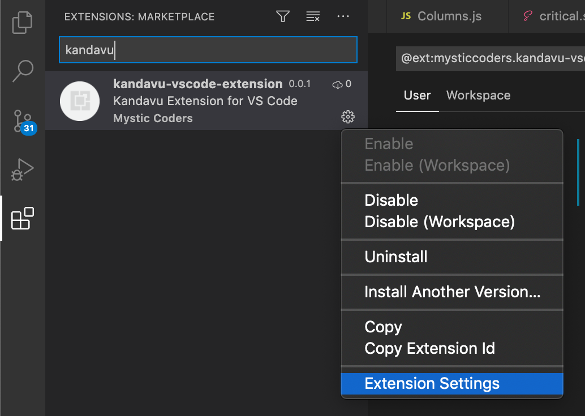

# Kandavu VisualStudio Code Extension

Draft plugin for adding status updates to Kandavu using Visual Studio Code

## Access Token

In order to update your status on Kandavu, you'll need to visit your profile at https://kandavu.dev/profile and scroll down to the section where it has you generate a Personal Access Token. Copy that value and go to Visual Studio Code Preferences -> Extensions -> Kandavu and paste that value into the "Access Token" field.

## Adding a Status

You can add a new status in two ways:

* Using the keyboard shortcut Cmd+K on a Mac, or Alt+K on Windows/Linux.
* Click the "kandavu" name in the status bar

Watch this space for future features and updates.

Thank you!